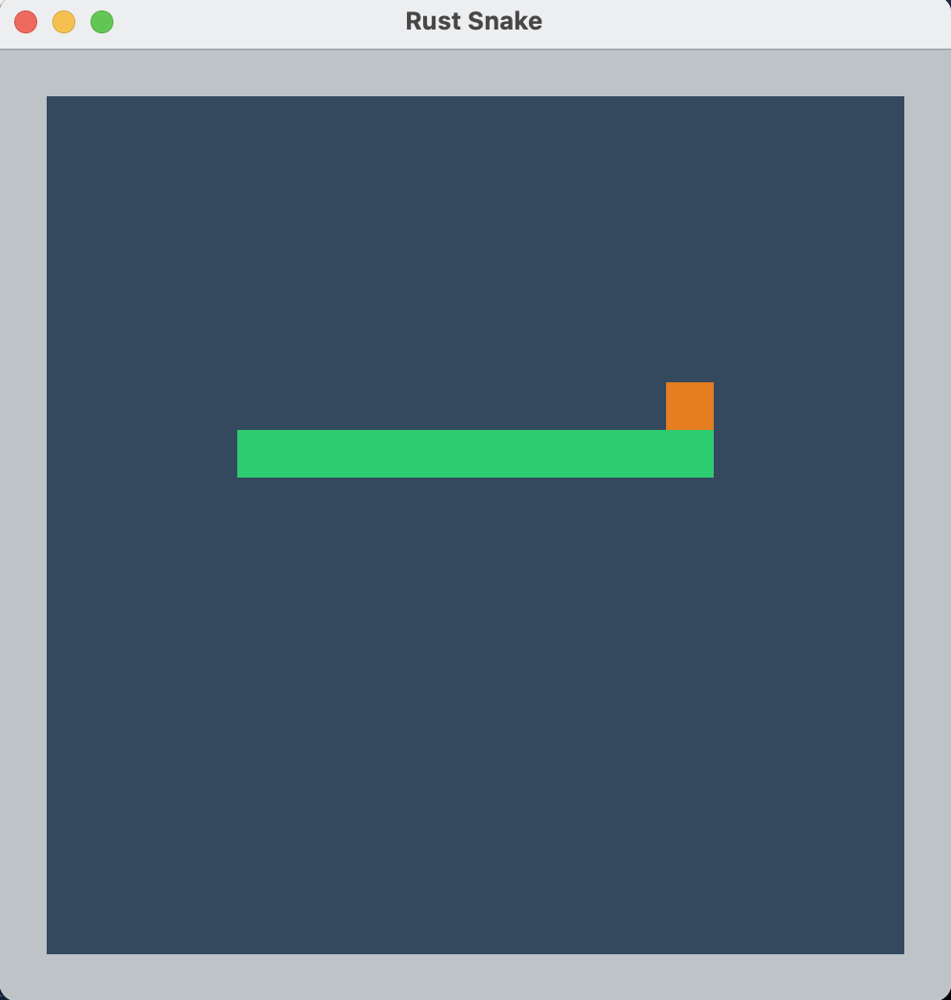

# Rust Snake

A snake game written in Rust.



## How To Run ?

First, install the Rust development evnironment from [here](https://www.rust-lang.org/tools/install) (if you do not have one).

Second, run the following command in the project directory:

```
> cargo run
```

Enjoy!

## Game Controls & Rules

- Use the arrow keys on the keyboard to move the green snake.
- Eat the orange food to make the snake stronger (or longer).
- When the snake hits the border or itself, it dies.
